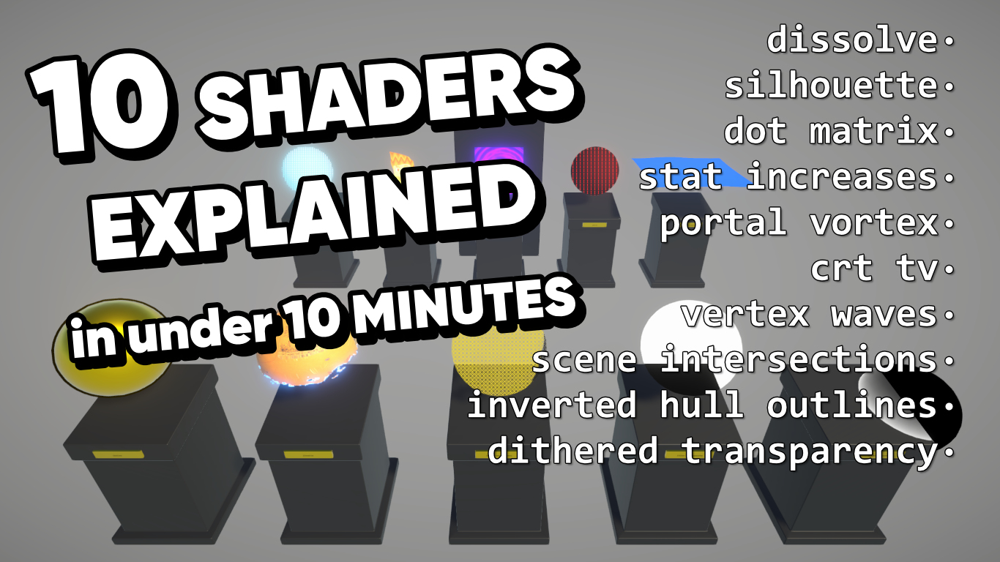

# 10 Shaders for Unity URP

A repository for my '10 shaders in 10 minutes' project. Contains 10 varied shaders which cover a good range of Unity's shader capabilities.

## Overview

Unity supports many different kinds of shaders, and this repository was created to show off 10 examples of such shaders: inverted hull outlines, dissolve, dithered transparency, silhouette, scene intersections, dot matrix, stat increases, portal vortex, CRT TV, and vertex waves. Each shader is relatively short and designed to be explainable in about a minute each.

## Software

This project uses Unity 2020.3.21f1 (LTS) and URP 10.6.0, but it should work with other versions.

## Tutorials

This project is part of a tutorial available in the following places:

- [https://www.youtube.com/watch?v=vje0x1BNpp8](https://www.youtube.com/watch?v=vje0x1BNpp8)

## Authors

This project and the corresponding tutorials were created by Daniel Ilett.

## Release

This project was released on April 3rd 2022.
